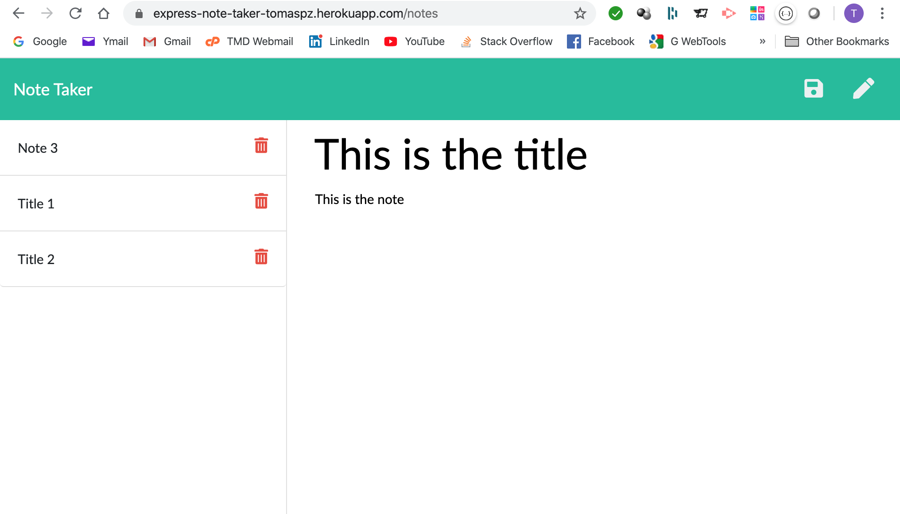

# Node & Express Note Taker

## Application Screenshot



## Description

This application can be used to write, save, and delete notes. This application uses an [express](https://expressjs.com/) server backend created in [Nodejs](https://nodejs.org/en/). The app saves and retrieves notes in a [JSON](http://json.org/json-en.html) format.

The application has several routes that you can query:

* The routes `/` and `*` returns `index.html`.
* The route `/notes` returns `notes.html`.
* The route `/api/notes` returns the notes in json format.
* The route `/api/notes/:id` returns a note with a specific id.
* You can also post new notes to the `/api/notes` endpoint.

The notes posted by the user are saved in a `db.json` file on the backend. This file will store all the notes and will be used to retrieve notes too using the `fs` module ([Node filesystem module](https://nodejs.org/api/fs.html#fs_file_system)).

By clicking the trash icon on a saved note, the user can delete that note.

Notes are saved until the user deletes them.

## User Story

```
AS A user, I want to be able to write and save notes

I WANT to be able to delete notes I've written before

SO THAT I can organize my thoughts and keep track of tasks I need to complete

As a USER that needs to keep track of a lot of information,

I WANT to easily recall something important 

SO THAT I can persist my notes until I do not need them anymore.
```

## Criteria

* Application allow users to create and save notes.

* Application allow users to view previously saved notes.

* Application allow users to delete previously saved notes.

- - -

## URL of the deployed application

[Heroku - Express Note Taker](https://express-note-taker-tomaspz.herokuapp.com/)

## The URL of the GitHub repository

[GitHub - Express Note Taker](https://github.com/tomaspz/express-note-taker)